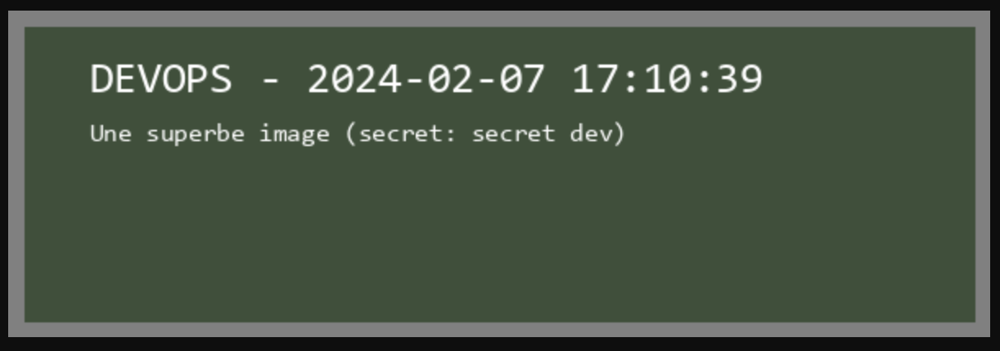
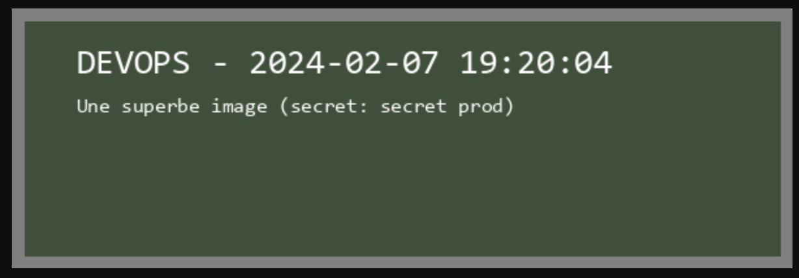

# Rapport de documentation

## Introduction

Ce projet est une application PHP qui permet d’afficher une image avec la date et l’heure, ainsi que du texte.
Il a été réalisé dans le cadre du cours de Security & Privacy, dispensé par Christian DELETTRE.
Ce document décrit les étapes à reproduire pour réaliser ce TP.

## Partie 1 : Configuration initiale de l’environnement

### Repository GitHub

Pour collaborer à plusieurs sur ce projet, nous utilisons un référentiel de code centralisé. Nous avons choisi GitHub pour cette tâche, car il s'intègre facilement avec de nombreux autres outils de développement.
Voici les étapes pour mettre en place notre projet sur GitHub :
1. Récupération des fichiers depuis le site de l'enseignant,
2. Création d'un projet sur GitHub,
3. Clonage du projet sur nos machines locales,
4. Ajout des fichiers récupérés,
5. Commit initial sur la branche main.

Cette étape est réalisée par une seule personne qui enverra des invitations aux autres membres pour accéder au projet.

### Branching strategy et environnements

Nous travaillons essentiellement sur deux branches : `main` et `develop`.
- La branche `main` est la branche principale du projet. C'est la branche qui contient le code qui sera déployé en production. Ce code est stable et testé.
- La branche `develop` est la branche sur laquelle nous travaillons. C'est la branche qui contient le code en cours de développement. C'est sur cette branche que nous faisons nos tests. Ce code sera déployé sur l'environnement de développement.

Une fois le code de la branche `develop` testé et validé, nous créons une merge request pour fusionner le code sur la branche `main`. 

### Circle CI

Circle CI est un service d'intégration continue et de livraison continue (CI/CD) qui permet d'automatiser le test et le déploiement des applications.

Pour le configurer, il faut suivre les étapes suivantes :
1. Créer un compte Circle CI.
2. Autoriser l’accès via GitHub à un projet.
3. Choisir "Create Project" puis sélectionner le projet sur GitHub.
4. Générer une clé ED et configurer l’accès SSH.
5. Sélectionner "Follow project".
6. Accéder au projet via CircleCI.

⚠️ Attention, il faut impérativement générer une clé ED et non RSA, car sinon le déploiement ne fonctionnera pas.

Pour mettre en place une pipeline, nous devons d'abord créer un fichier nommé `.circleci/config.yml.` Cette pipeline se lancera automatiquement à chaque fois qu'un commit est effectué. Les détails concernant les différentes jobs et le workflow seront fournis dans la section suivante.


### Docker & GHCR

La pipeline s’occupe de construire une image Docker à partir du Dockerfile fourni, puis l’image est poussée sur GHCR (GitHub Container Registry). GHCR permet de stocker et de gérer les images Docker produites dans le cadre du projet.

Pour activer le push sur GHCR, définir les variables d’environnement suivantes sur Circle CI dans "Project settings" > "Environment variables" :
- `GHCR_USERNAME` : username GitHub.
- `GHCR_PAT` : personal access token généré sur GitHub avec les droits : `admin:org, delete:packages, repo, write:packages`.

⚠️ Le token donne accès à tous les repos. Une nouvelle fonctionnalité en beta permet de créer des tokens avec des droits plus restreints.

### Infisical

Infisical est un service de gestion sécurisée des secrets et configurations. Il va nous permettre de stocker nos secrets de manière sécurisée.

Pour l'utiliser, il faut suivre les étapes suivantes :
1. Créer un compte et un projet sur Infisical.
2. Ajouter les secrets en **dev** et en **prod**.
3. Générer un token Infisical et le mettre comme variable d’environnement sur Circle CI (`INFISICAL_TOKEN`).
4. Ajouter un job dans la pipeline qui récupère les secrets via la CLI infisical.

⚠️L'unique inconvénient de cette méthode est la nécessité de fournir le token Infisical directement à la pipeline pour accéder aux autres secrets. Pour contourner ce problème, nous utilisons une variable d'environnement dans CircleCI, qui reste masqué dans les logs la CI.

## Partie 2 : Configuration du pipeline

## Partie 3 : Extension du pipeline

### Déploiement sur EC2

Nous allons déployer deux instances sur EC2 : une pour la production (prod) et une pour le développement (dev).

#### Création des instances

Pour créer les deux instances EC2 sur AWS, il faut suivre les étapes suivantes:
1. Créer un compte AWS.
2. Accéder à EC2 > Instances > Launch an instance.
3. Nommer l'instance (prod ou dev).
4. Choisir le type d'instance `t2.micro` (éligible à l'offre gratuite).
5. Créer un groupe de sécurité et autoriser le trafic SSH depuis n'importe où.

#### Configurer l’accès SSH

Après la création des instances, il faut configurer l'accès SSH pour pouvoir déployer l'application depuis Circle CI. 

Pour cela, il faut suivre les étapes suivantes côté AWS:
1. Générer une clé ed25519 (pas RSA, car cela ne fonctionnera pas).
2. Assigner une clé distincte pour la DEV et une pour la PROD.
3. Sur AWS, se connecter à l'instance via la console et ajoutez la clé publique SSH au fichier `~/.ssh/authorized_keys` en tant que superuser.

Ensuite, pour configurer l'accès SSH sur Circle CI, il faut suivre les étapes suivantes:
1. Se connecter à Circle CI.
2. Aller dans Project Settings > SSH Keys > Add SSH Keys.
3. Mettre comme hostname l'instance Amazon `compute-1.amazonaws.com` et ajouter la clé privée.
Cela générera une empreinte de la clé SSH à utiliser dans CI. 
4. Enfin, il faut définir les variables `DEV_SSH_FINGERPRINT` et `PROD_SSH_FINGERPRINT` dans les variables d'environnement de Circle CI.

Cette configuration permet au runner de Circle CI d'accéder via SSH aux instances EC2 d'AWS pour déployer l'application.

#### Configuration de l’instance

Une fois les instances déployées, il faut y installer les paquets nécessaires. 
Ce sont des tâches ponctuelles que nous devons effectuer après la créaton d'une instance.
Donc, au lieu d'automatiser cela via CI, nous utilisons des scripts :
- Il y a un script pour la dev (`script/setup-dev.sh`) et un pour prod (`script/setup-prod.sh`).
- Il faut d'abord rendre les scripts exécutables avec `chmod u+x script/setup-dev.sh` ou `setup-prod.sh` et les lancer.

Ces scripts installeront PHP, GIT, APACHE, COMPOSER, INFISICAL, et lanceront le serveur Apache. Ils cloneront également le dépôt Git et le placeront dans `/var/www/html/public` pour que l'application Apache fonctionne.

#### Configuration APACHE

Les instances EC2 possèdent par défaut une IP publique. Pour rendre l'application accessible via Internet, il faut configurer le groupe de sécurité pour autoriser le trafic entrant.
Un groupe de sécurité sur une instance AWS fonctionne comme un pare-feu virtuel qui contrôle le trafic entrant et sortant de l'instance. 
Il définit un ensemble de règles qui spécifient les ports, protocoles, et plages d'adresses IP autorisés à accéder à l'instance pour le trafic entrant, et ceux que l'instance peut contacter pour le trafic sortant.

Pour autoriser le trafic entrant, il faut suivre les étapes suivantes :
- Accédez à EC2 > Instances > Choisir l'instance de **dev** ou **prod** > Sécurité > Groupe de sécurité > Règles entrantes.
- Ajoutez une règle HTTP et une règle HTTPS avec pour source `0.0.0.0/0`.

Ainsi, l'index de la page PHP sera accessible via l'IP publique de l'instance.

#### Déploiement via CI/CD

Ce script détaille la procédure de déploiement de notre application sur AWS en utilisant Circle CI. 
Il utilise l'empreinte de la clé SSH que nous avons défini plus tôt pour établir une connexion sécurisée avec l'instance AWS de dev, et exécuter des commandes à distance. 
En plus, le script est conçu pour récupérer un secret via Infisical et l'intégrer dans le fichier .env de l'application. Ce secret est ensuite chargé par la page PHP et affiché sur le site web.

```bash
  deploy-ssh-dev:
    executor: simple-executor
    steps:
      - add_ssh_keys:
          fingerprints:
            - "${DEV_SSH_FINGERPRINT}"
      - deploy:
          name: Deploy to AWS
          command: |
            set -x
            ssh -v -o StrictHostKeyChecking=no $DEV_SSH_USER@$DEV_SSH_HOST \<< EOF
            PHP_FPM_VERSION=$(php -v | head -n 1 | cut -d ' ' -f 2 | cut -d '.' -f 1-2)
            cd $DEV_DEPLOY_DIRECTORY
            git pull origin $CIRCLE_BRANCH
            composer update
            composer install --optimize-autoloader --no-interaction --prefer-dist
            echo "APP_SECRET=\"\$(infisical export --token=$INFISICAL_TOKEN -e=dev --format=json | jq -r '.[] | select(.key == "APP_SECRET") | .value')\"" > .env
            sudo rm -rf /var/www/html/*
            sudo cp -R . /var/www/html/
            (flock -w 10 9 || exit 1; sudo -S service php${PHP_FPM_VERSION}-fpm restart ) 9>/tmp/fpm.lock
            EOF
```
### Jobs d’intégration et d’évaluation du code

Ces jobs visent à améliorer la qualité et l'intégrité du code.
⚠️ On exclut le répertoire `vendor` qui est généré automatiquement par Composer pour se concentrer sur les répertoires `public` et `src`.

#### QUALITÉ DU CODE
- **check-php-md** (PHP Mess Detector) : Cet outil évalue la qualité du code en identifiant les problèmes via des règles prédéfinies comme **codesize** pour la complexité du code, **unusedcode** pour le code inutilisé, et **naming** pour les conventions de nommage. Cet outil vise à améliorer la lisibilité et l'efficacité du code.
- **check-php-doc** : Cet outil analyse la conformité de la documentation PHP avec les normes établies, pour maintenir une documentation de code de haute qualité.

#### ÉVALUATION DU CODE
- **evaluate-php-stan** : Cet outil remplace de PHPLOC en raison de problèmes de compatibilité. PHPStan offre une analyse statique approfondie pour détecter les erreurs dans le code PHP sans exécution (SAST), ce qui contribue à l'amélioration de la qualité du code.
- **evaluate-php-metrics** : Cet outil analyse le code PHP pour mesurer sa qualité et sa complexité. Il regarde combien de chemins différents le code peut emprunter (complexité cyclomatique), à quel point différentes parties du code travaillent bien ensemble (cohésion), et combien de niveaux il y a dans la hiérarchie de classes (profondeur des classes).

## Partie 4 : Résultats 

- Environnement de développement : http://54.166.25.13/

- Environnement de production : http://54.172.218.85/



